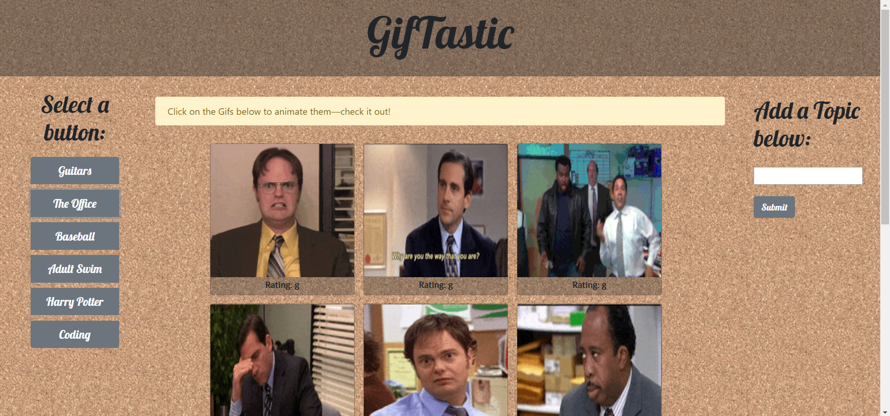

# GifTastic

### Overview

An app that pulls the Giphy API to allow users to view gifs.  

### Objective

You can use the provided topic buttons on the left or add a button from the right side of the page. Once clicked the gifs will appear on the body of the page. Then once the gifs are loaded you can click on the them to make them play.

### Deployed Site

[Click Here](https://scottjr101.github.io/GifTastic/)

